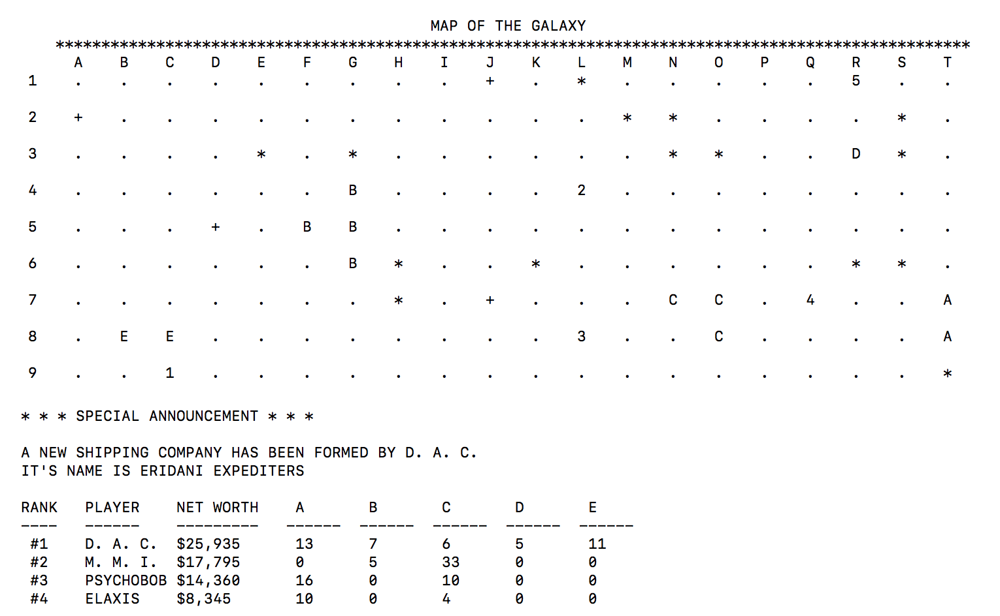

#  STAR LANES
THE CLASSIC GAME OF INTERSTELLAR TRADING IS BACK...

<p align="left">

</p>

... AND IT'S BIGGER AND BETTER THAN EVER!

## Features
- Basic game: Classic 12 x 9 map with five available companies.
- Deluxe game:  New 16 x 9 map with ten available companies.
- Custom game: Make a map as large as 20 x 9, customize house rules and more!
- Computer controlled players who play AGGRESSIVELY. Be vigilant! 
- Leaderboard to track series of games.

## How To Play
When you run Star Lanes, you'll be offered instructions. If you're new to the game, please read these instructions to familiarize yourself with the game play.

#### Game Strategy and Tips
- When companies merge, shares in the defunct company are converted into the surviving company at 2:1. If the defunct company share price is less than half the surviving company share price... PROFIT!
- The trick is to profit from merges: buy low, merge high. **Merge Order** becomes critical as well as **Merge Timing**, where you can maximally leverage your profits from the previous merge.
- If you're falling behind, you may be given an opportunity to concede the game. Players who have declined concession have actually ended up winning. Don't give up too easily!
- In the Terminal window, scroll up to see computer opponents' current coordinate options. Are they sitting on a coordinate you need?
- Luck is involved to win and you cannot win every game (unless you customized humans to have excessive initial cash). A bigger map with more available companies affords you more opportunities to catch up if you fall behind. Go big!

#### Differences from 1970's Star Lanes
- Companies used to split 2:1 at $3,000 share price. They no longer split, ever.
- Instead, when a company reaches a certain size (11 in Basic, 15 in Deluxe) it becomes **safe**. Safe companies cannot be merged.
- When any company reaches a maximum size (41 in Basic, 55 in Deluxe), or if all companies are safe, the leading player can call the game.

## macOS: Install Star Lanes
- Click on **Releases** tab above, and download the StarLanes.pkg file.
- Run the .pkg file to install Star Lanes. Like other installers, you'll need to have Administrator privileges.
- Open Terminal app (⌘-Space, then enter Terminal)
- From Terminal, enter starlanes to run.
```sh
starlanes
```
- You'll need to adjust the Terminal window to fit the game screen.

## macOS: Uninstall Star Lanes
- Open Terminal app (⌘-Space, then enter Terminal)
- Enter the following lines to remove the app and the save game file.
```sh
sudo rm /usr/local/bin/starlanes
rm ~/.starlanes
```

## macOS or Ubuntu: Run from Source Code
#### Pre-requisite: Install Swift language for your OS.

```sh
$ cd [to folder containing Package.swift]
$ swift package generate-xcodeproj
$ swift run
```
